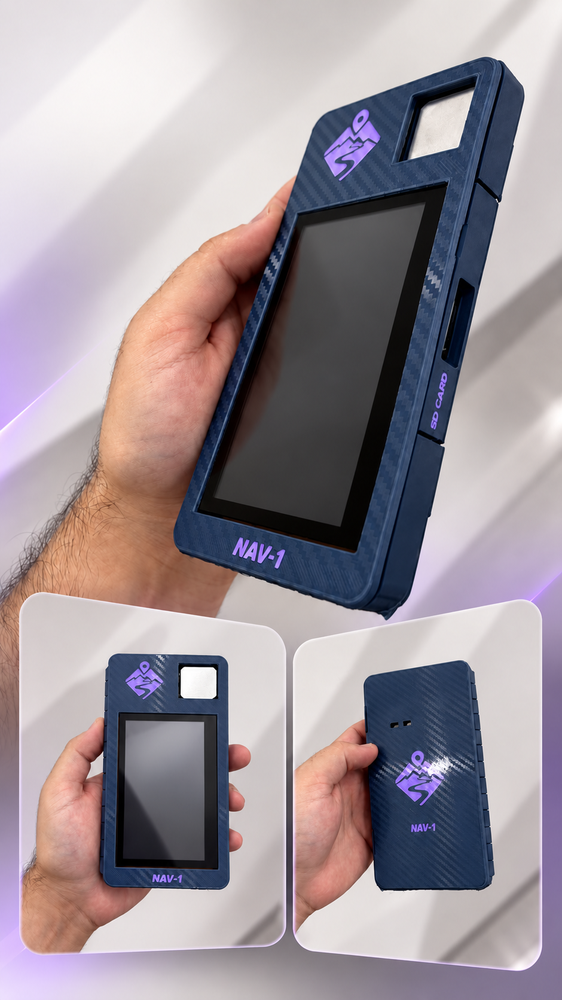
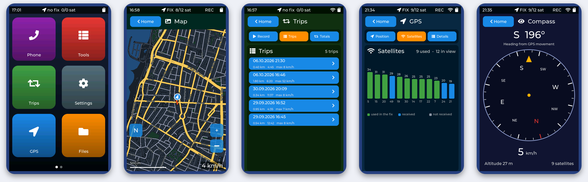
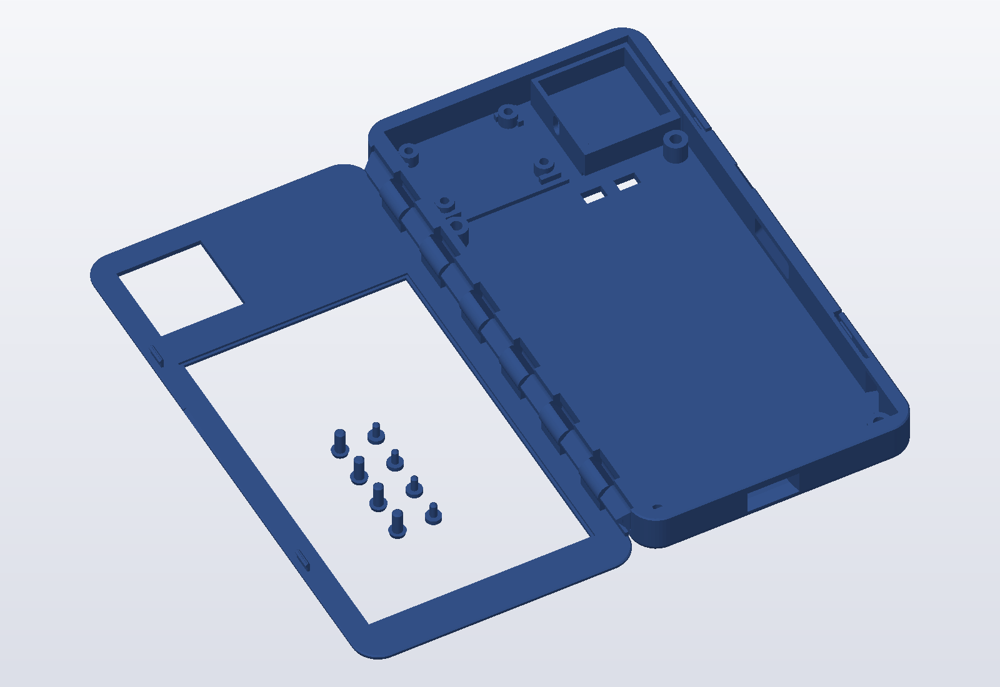
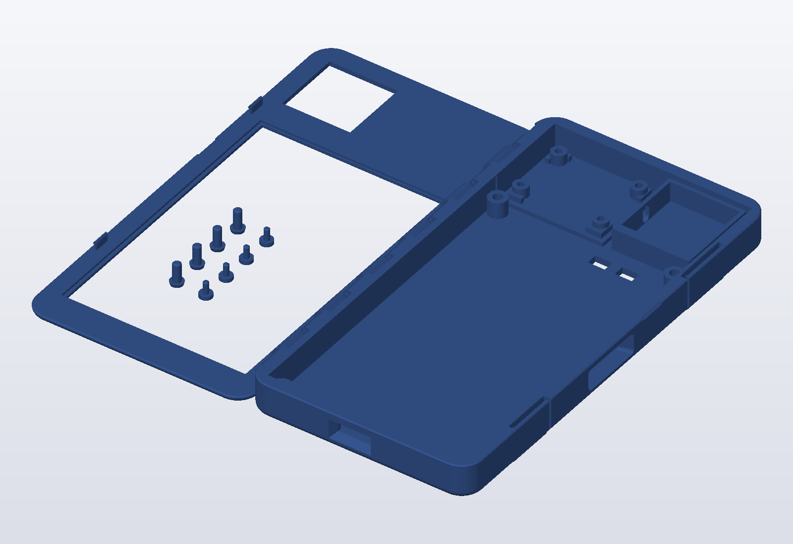

<p align="center">
  
</p>

<h1 align="center">NAV-1</h1>

<p align="center">
  A pocket GPS navigator built from scratch: touch-screen UI, offline street map, trip recorder, compass,<br>
  Wi-Fi / Bluetooth and over-the-air updates — on an ESP32-S3 board, in a 3D-printed case.
</p>

<p align="center">
  
</p>

NAV-1 is a handheld GPS navigator and trip recorder. It has a 4.3" capacitive touch screen used in portrait, a
u-blox GPS module, a microSD card, Wi-Fi and Bluetooth LE. Everything — firmware, UI, map renderer, PC tooling and
the enclosure — is in this repository.

<p align="center">
  
</p>

## What it does

| | |
|---|---|
| **Offline street map** | A vector map of a whole country from one file on the SD card, drawn on the device by its own renderer. Follows your position (north up or heading up), drag to look around, zoom 13–17.5, scale bar, your recorded trip drawn on top. |
| **Trip recorder** | One tap to record. Every trip is saved as GPX + CSV with a summary; list, totals, a route preview and *Show on map*. GPX downloads to a phone over Wi-Fi. |
| **GPS** | Position, speed, heading, altitude, accuracy, a satellite chart (GPS + Galileo, signal per satellite) and fix details. The GPS module is configured by NAV-1 itself at every start. |
| **Compass** | Heading from the GPS course while you move, as a heading-up dial with speed and altitude. |
| **Phone link** | The device serves a web page (live location, trips, offline map) over Wi-Fi or its own hotspot; a QR code on the screen opens it. A Bluetooth LE service publishes status and location. |
| **Files / Storage** | Browse and delete SD files, see what uses the card, keep the newest GPS logs. |
| **Settings** | Wi-Fi (on-screen keyboard), hotspot, Bluetooth, brightness and auto-dim, time zone. Optional `settings.json`, icons and wallpaper from the SD card. |
| **Updates** | Install new firmware over Wi-Fi; the new image verifies itself and rolls back automatically if it does not run correctly. |

All screens: **[docs/SCREENSHOTS.md](docs/SCREENSHOTS.md)**.

**Status:** version 0.5.3 is in daily use. Three tiles on the second home page (Alerts, Notes, Messages) are placeholders that say "Coming soon". Ideas that fit the hardware and are not built yet: speed and signal alerts, notes with the on-screen keyboard, trip statistics, a satellite layer on the device's own map, a quick portrait / landscape switch.

## Install it (no build tools needed)

Ready-made firmware is in [`docs/firmware`](docs/firmware). Connect the board with a USB-C data cable, then pick one:

| | |
|---|---|
| **In the browser** (Chrome / Edge) | Open the **web flasher**: <https://shaibenisti.github.io/NAV-1-GPS-Navigator/> and press *Install*. |
| **PowerShell** (Windows) | `.\flash.ps1` — finds the board, installs `esptool` if needed, flashes in about 30 seconds. |
| **Terminal** (macOS / Linux) | `./flash.sh` |
| **Any tool** | Write [`docs/firmware/NAV1-v0.5.3-full.bin`](docs/firmware/NAV1-v0.5.3-full.bin) to flash offset `0x0` (ESP32-S3, 16 MB, DIO, 80 MHz). |

Then insert a **FAT32 microSD card** and, if you want the street map, put it on the card:

```powershell
.\tools\scripts\maps.ps1 -Card G:        # downloads a map of your region and copies it (see docs/USER_GUIDE.md)
```

Go outside, wait for the first GPS fix (a few minutes after power-up), and open **Trips → Start trip**.
To build from source instead, see [docs/BUILD.md](docs/BUILD.md).

## Hardware

Three bought parts, plus a card and a printed case:

| Part | |
|---|---|
| **ESP32-S3 4.3" touch board** (Sunton ESP32-8048S043C-I) | 800 × 480 display, capacitive touch, Wi-Fi / Bluetooth LE, microSD slot, USB-C — runs everything |
| **GPS module NEO-8M** with external ceramic patch antenna | Position and time (GPS + Galileo) |
| **4-pin cable** SH 1.0 mm, 200 mm, to DuPont female | Connects the GPS module to the board's P4 connector |
| microSD card, USB-C cable and a 5 V supply (a power bank works) | Storage and power |
| **3D-printed case** | Two parts with a print-in-place hinge and hidden snap latches — [`hardware/case`](hardware/case) |

Parts list with wiring, GPIO map and measured facts: [docs/HARDWARE.md](docs/HARDWARE.md).

### The case

<p align="center">
  
  
</p>

Open `hardware/case/V11_5_print_in_place.stl` on GitHub for an interactive 3D view you can rotate and zoom. The
3MF is the same print as a slicer project. Print settings and assembly: [docs/CASE.md](docs/CASE.md).

## Documentation

| | |
|---|---|
| [User guide](docs/USER_GUIDE.md) | How to use every app, the phone link, the offline map, customising |
| [Screenshots](docs/SCREENSHOTS.md) | Every screen of the UI |
| [Hardware](docs/HARDWARE.md) | Parts, wiring, GPIO map, display, touch, GPS, SD |
| [Architecture](docs/ARCHITECTURE.md) | Shell, services, display path, offline map renderer, updates, tooling |
| [Build](docs/BUILD.md) | Build, flash, console, validation, helper tools |
| [Case](docs/CASE.md) | Design, printing, assembly |

## Repository

| Path | |
|---|---|
| `firmware/` | The firmware: shell and apps, services (GPS, trips, map, Wi-Fi, BLE, web, OTA), display path |
| `idf/` | The ESP-IDF project that builds it (system settings in `sdkconfig.defaults`, vendored display / touch / GPS libraries) |
| `tools/scripts/` | PowerShell / Python workflow: validation, console, screenshots, OTA, map builder, trip viewers, SD card checks |
| `tools/bringup/` | Small stand-alone sketches used to verify the hardware |
| `tools/maps-www/` | The offline map page the device serves to phones |
| `hardware/case/` | Print files of the enclosure (STL + 3MF) |
| `docs/` | Documentation, firmware images (`docs/firmware`) and the web flasher (`docs/index.html`) |

## License

[MIT](LICENSE) for the firmware, tools, documentation and case design. Third-party libraries keep their own licenses.

## Acknowledgements and data

- UI: [LVGL](https://lvgl.io) 9 (MIT). Display driver glue: [GFX Library for Arduino](https://github.com/moononournation/Arduino_GFX), touch: TAMC_GT911, NMEA parsing: TinyGPSPlus — vendored in `idf/components` with their licenses. Runtime: ESP-IDF and arduino-esp32 (Apache-2.0).
- Street map: [Protomaps](https://protomaps.com) basemap built from © [OpenStreetMap](https://www.openstreetmap.org/copyright) contributors (ODbL). The map data is **not** part of this repository; `maps.ps1` builds it on your PC. Optional satellite imagery for the phone map page: Sentinel-2 cloudless 2024 by [EOX](https://s2maps.eu) (CC BY-NC-SA 4.0, non-commercial).
- Map page for phones: [Leaflet](https://leafletjs.com), protomaps-leaflet, pmtiles.js (BSD).
- Case labels use Inter (SIL OFL).
