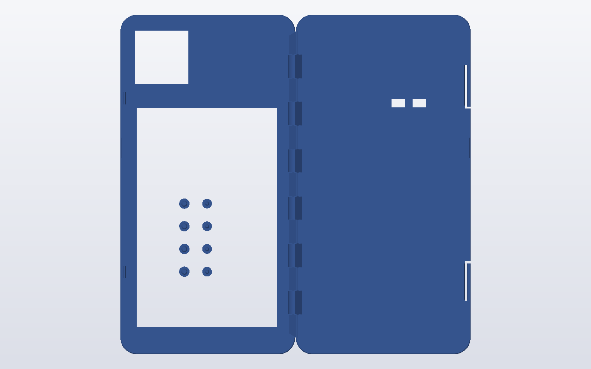

# Case

NAV-1 lives in a 3D-printed two-part enclosure designed around the ESP32-8048S043C-I board, the GPS module and its patch antenna. It was designed in OpenSCAD and printed in one go on a desktop FDM printer with a two-colour change for the logo and labels. This repository contains the ready-to-print files; the parametric sources are not published.

## 3D preview

The print layout as rendered from the STL (shell on the right, lid on the left with the eight pins standing in its screen window, hinge in between):

  
  

GitHub shows `hardware/case/V11_5_print_in_place.stl` as an interactive 3D model — open the file in the browser to rotate and zoom it.

## Files

| File | |
|---|---|
| [`hardware/case/V11_5_print_in_place.stl`](../hardware/case/V11_5_print_in_place.stl) | The complete print: shell + lid joined by the hinge, 8 loose pins, and the label / logo inlays as separate bodies (10 bodies). Footprint 172 × 165 × 16.3 mm. |
| [`hardware/case/V11_5_print_in_place.3mf`](../hardware/case/V11_5_print_in_place.3mf) | The same print as a 3MF project (parts and colour assignment preserved). |

## Design

| | |
|---|---|
| Outside size (closed) | 83.57 × 164.5 × 15.6 mm |
| Orientation | Held in portrait, screen to the user. **USB-C at the bottom, microSD on the right.** The antenna window is above the screen, next to the logo. |
| Parts | **Rear shell** (board, standoffs, GPS tray and antenna cradle) and **front lid** (flat 2.4 mm face plate with the screen window, antenna window and the labels). |
| Hinge | A continuous rounded spine on the left side, printed in place: one 3 mm pin runs through 13 alternating knuckles with 0.4 mm clearance, so the lid is captive but opens 180°. The lid prints open, flat beside the shell, and folds over it. |
| Latches | Two **hidden snap latches** on the right wall: the outer 1.6 mm of the wall itself is cut free as a spring slab with a bead that drops into a notch in the lid. Nothing protrudes from the outside. A fingernail notch at the seam opens it. |
| Openings | USB-C (funnelled mouth, bottom edge), microSD with a finger funnel and an `SD CARD` label (right side), two small holes for the **BOOT** and **RST** buttons on the back, the screen window (68.5 × 106.5 mm) and the recessed GPS antenna window. |
| Labels | NAV-1 logo and name on the front, logo and name on the back, `BOOT` / `RST` / `SD CARD` — as 1.2 mm-deep two-colour inlays (separate bodies for the second filament). |
| Finish | True quarter-round rear edge (R2.5), rounded lid edge (R1.8), 8 mm vertical corner radius, 0.4 mm seam chamfers that hide small misalignment. |

Inside: four standoffs carry the display board (it is held by four plain pins through its mounting holes), four posts carry the GPS module (four small pins), a cradle holds the patch antenna, and a slot in the left wall lets the antenna cable reach the module. A relief pocket in the right wall gives a cable room beside the board. The inner geometry that locates the board (standoffs, posts, cradle, ceiling at 13.2 mm) is the part that was fitted against real hardware, so it is the part to leave alone when modifying the case.

## Printing

- **No supports.** Shell: rear face on the bed. Lid: front face on the bed (it is printed mirrored beside the shell). Both big faces are on the bed, so the build-plate texture *is* the surface finish (textured PEI = matte, smooth PEI = glossy).
- 0.4 mm nozzle, 0.2 mm layers. The inlays are 6 layers deep; print the first layer slowly (~30 mm/s) for both colours, on a clean dry plate, and purge enough at the colour change. Keep the first-layer line width ≥ 0.42 mm for the inlay parts.
- Hinge clearance is 0.40 mm. If the hinge stays stuck, rock the lid gently up and down a few times before folding it; if that is not enough, the printer needs a slightly larger clearance.
- The eight pins print standing head-down inside the lid's screen window: four **screen pins** (Ø 2.95 mm, plain) go through the display board's holes into the standoffs; four **GPS pins** (Ø 2.05 mm, 6 mm long) hold the GPS module on its posts.

## Assembly

1. Free the hinge, check that the lid moves.
2. Fit the GPS module on its four posts and press in the four GPS pins.
3. Fit the main board on its four standoffs and press in the four screen pins; route the antenna cable through the slot in the left wall to the module and seat the antenna in its cradle.
4. Fold the lid 180° over the shell and press until both latches click. To open, lift at the fingernail notch on the right side.

The case needs no screws or glue.
