# Screenshots

Real screenshots of the device (480 × 800, portrait), taken over the USB console with `tools/scripts/shotdocs.ps1`. The GPS, Compass, Map and Trips screens were captured while a recorded walk, moved to a neutral location, was replayed. Screens that open only by touch (dialogs, a trip's detail page) are not included.

## Home

Two pages of tiles; swipe sideways to change page.

| Page 1 | Page 2 |
|:--:|:--:|
| 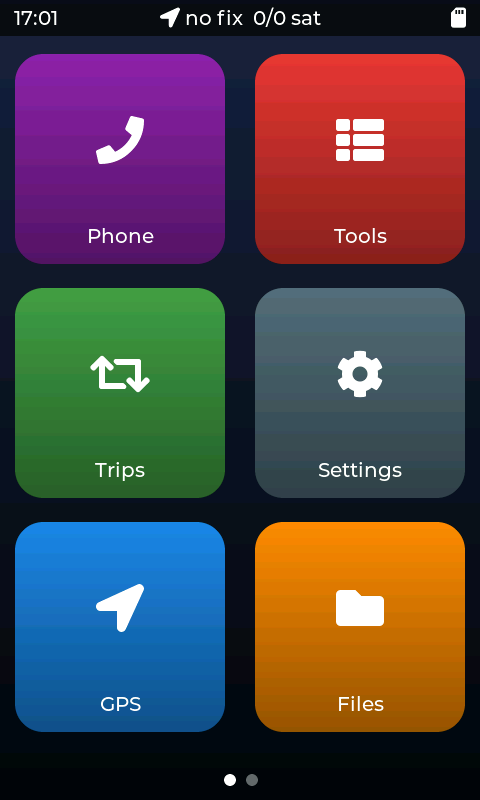 | 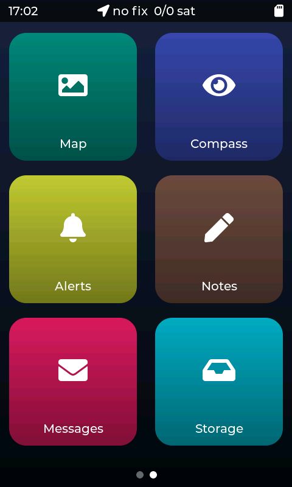 |

## Map

The offline street map: follows the position (north up or heading up), zoom 13–17.5, scale bar, the recorded trip on top.

| Following | Street level | Heading up |
|:--:|:--:|:--:|
| 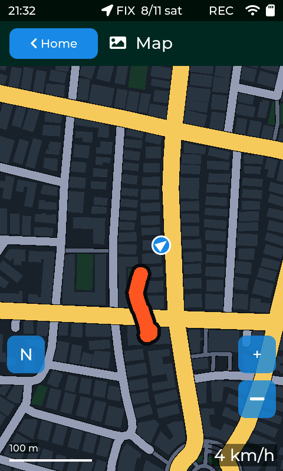 | 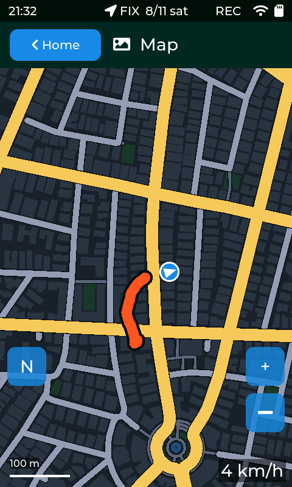 | 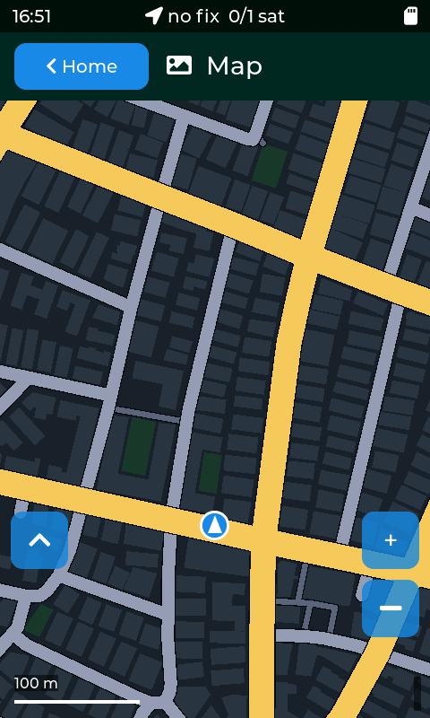 |

| Overview (zoom 13) | A finished trip (Trips → Show on map) |
|:--:|:--:|
| 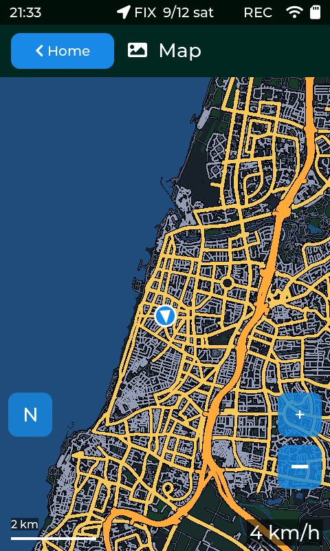 | 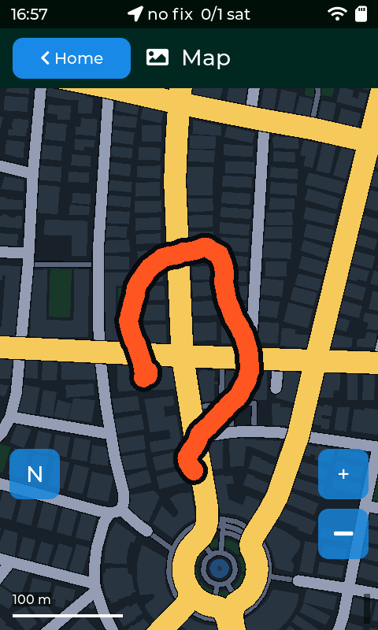 |

## GPS and Compass

| Position | Satellites | Details | Compass |
|:--:|:--:|:--:|:--:|
| 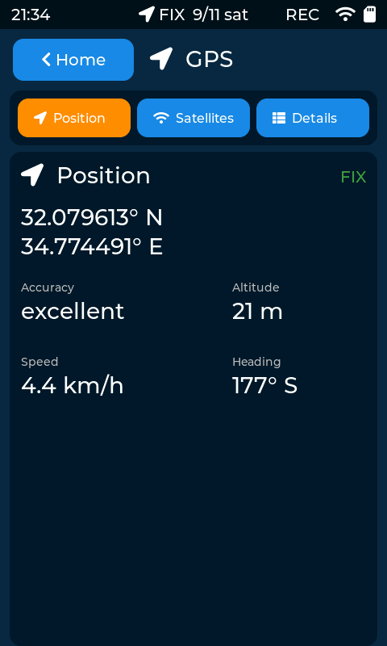 | 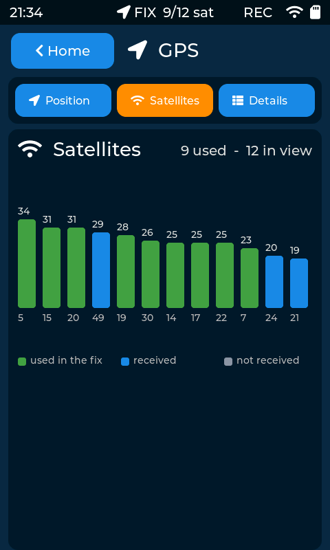 | 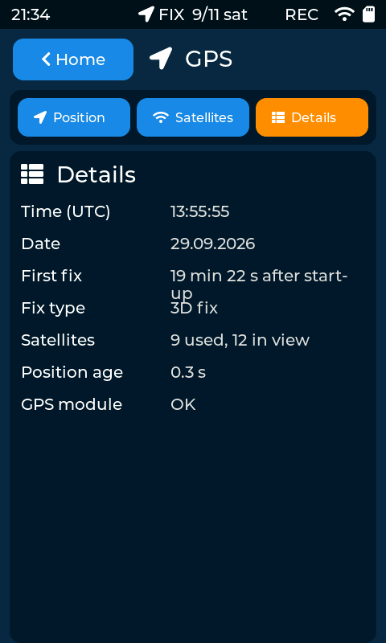 | 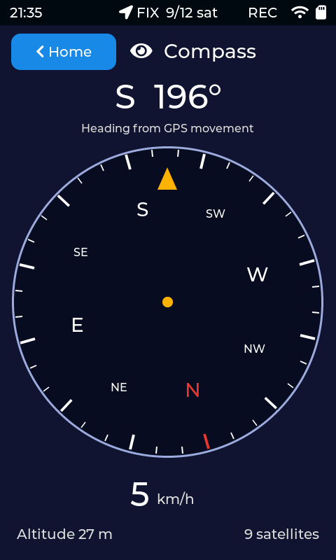 |

## Trips

| Record | Trips | Totals |
|:--:|:--:|:--:|
| 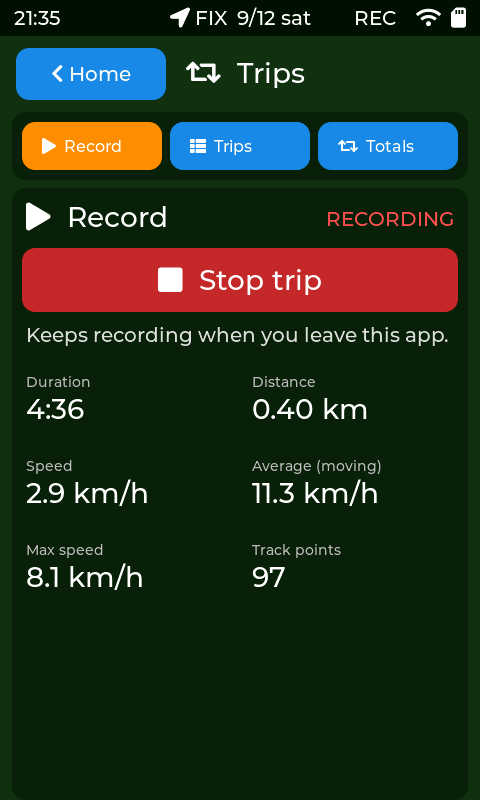 | 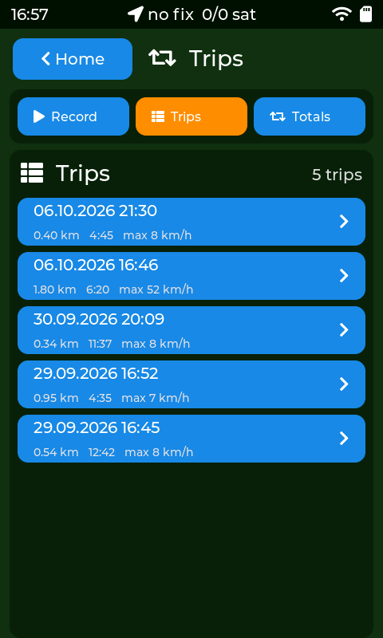 | 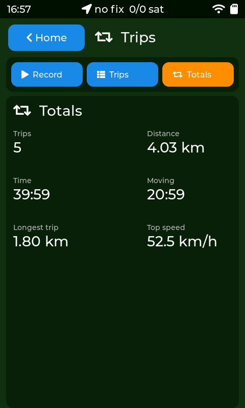 |

## Phone, Files and Storage

| Phone link (QR hidden) | Files | Storage |
|:--:|:--:|:--:|
| 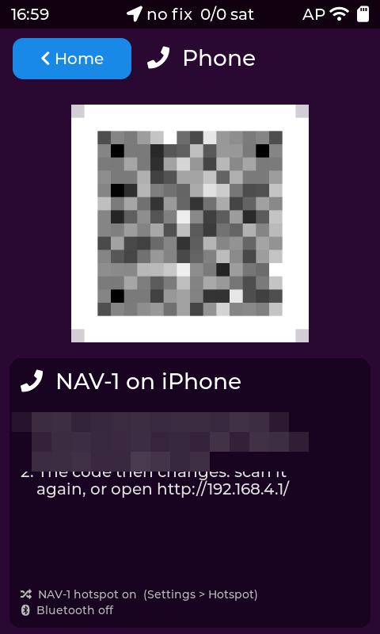 | 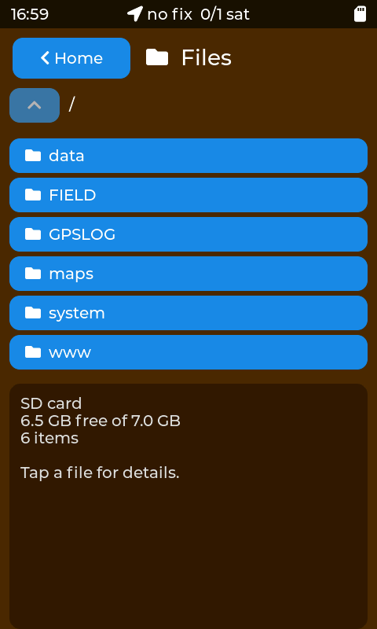 | 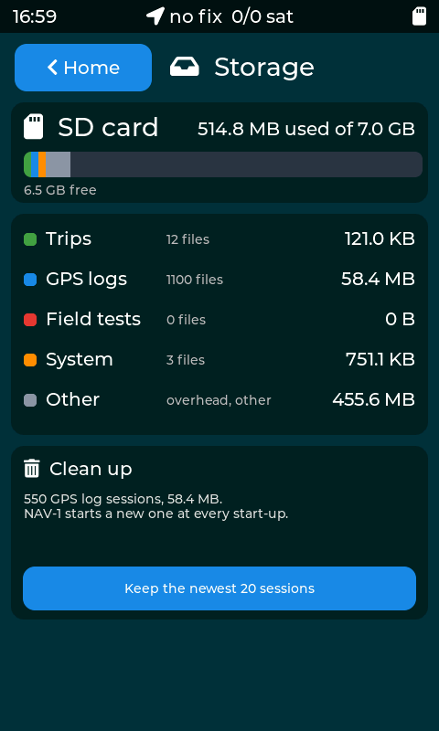 |

## Settings

| Wi-Fi | Bluetooth | Hotspot |
|:--:|:--:|:--:|
| 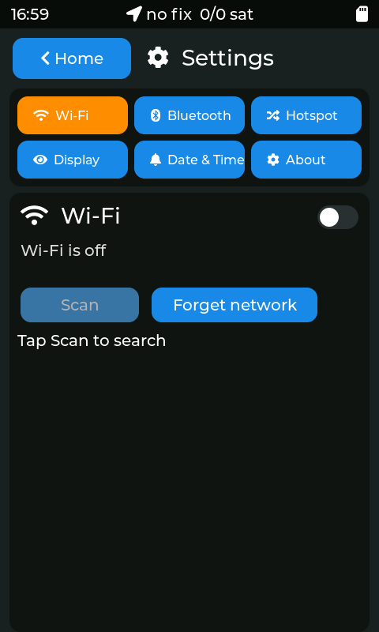 | 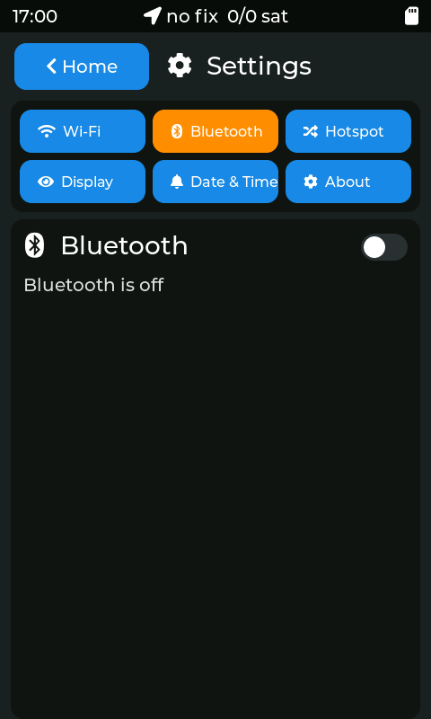 | 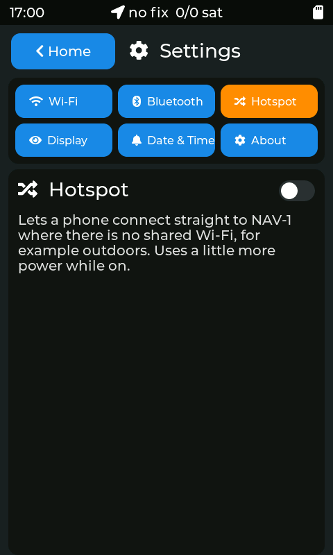 |

| Display | Date & Time | About |
|:--:|:--:|:--:|
| 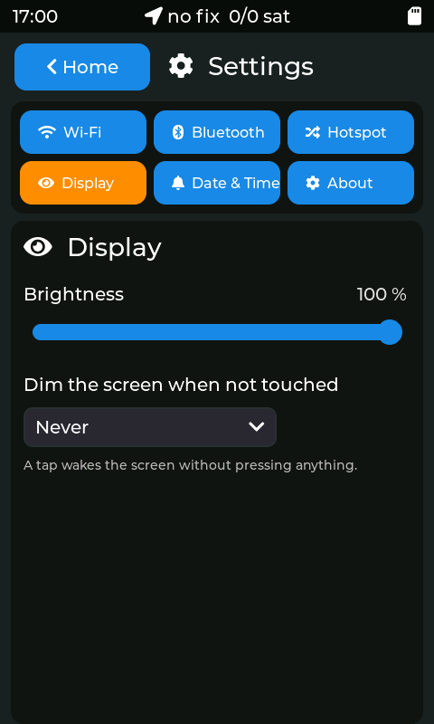 | 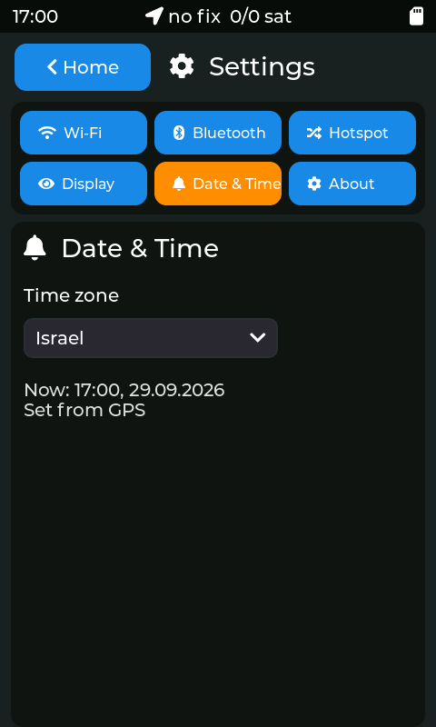 | 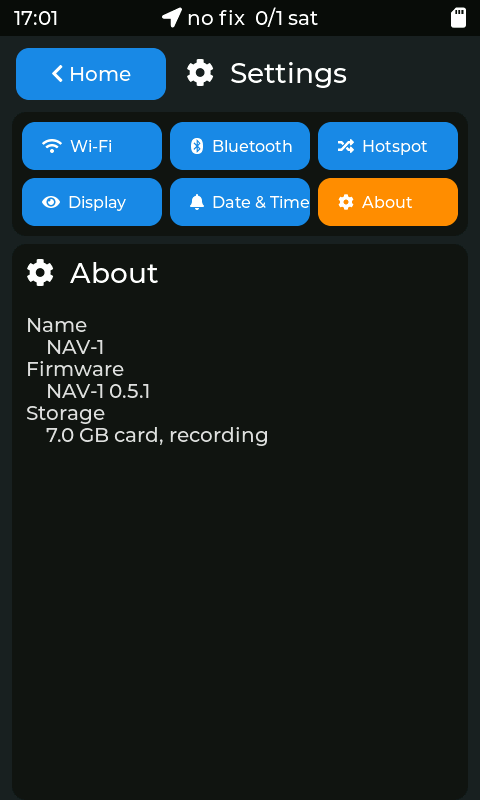 |

## Tools

| Health | Touch test | Update |
|:--:|:--:|:--:|
| 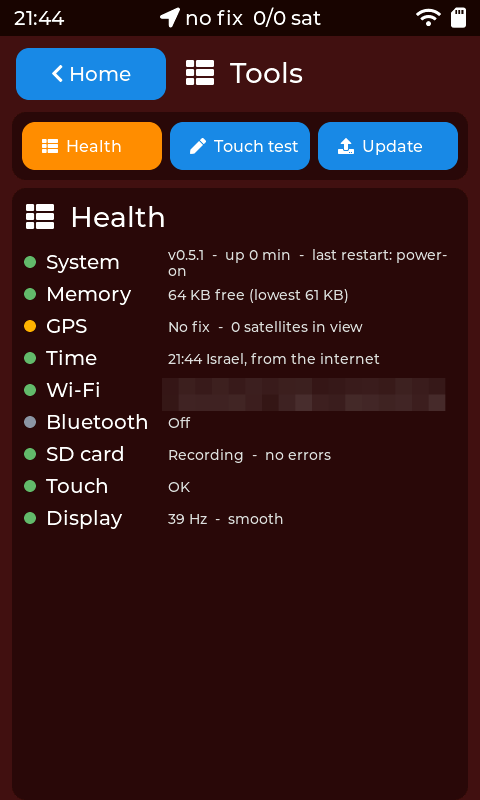 | 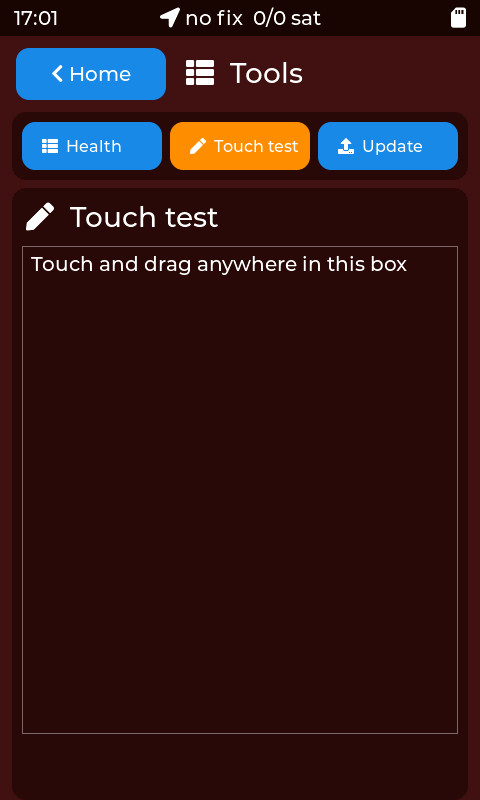 | 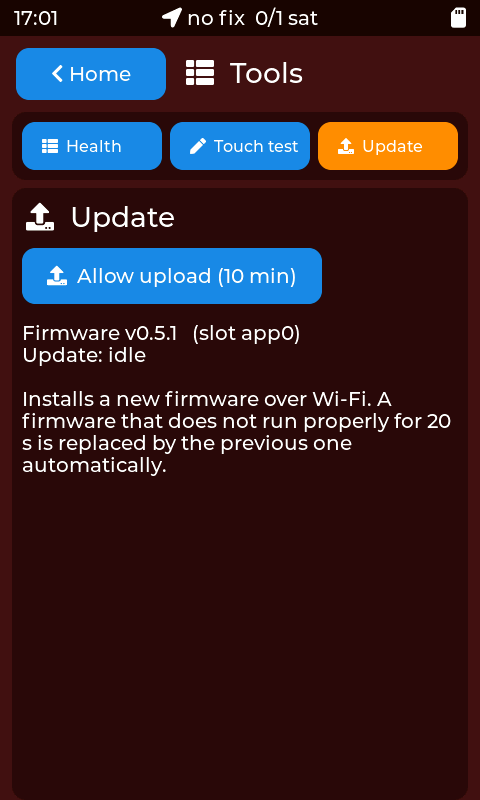 |
